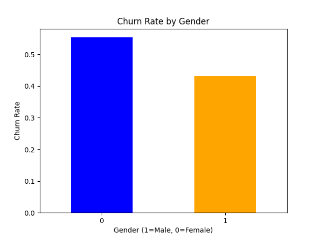
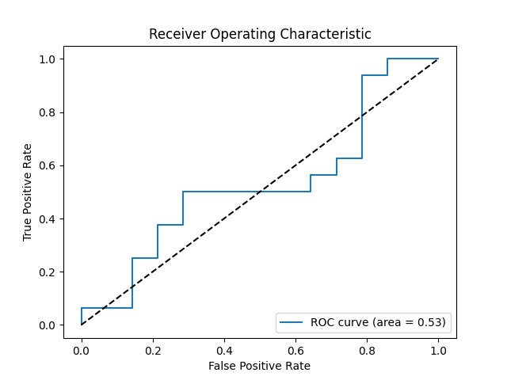

# Customer Churn Prediction

## Overview

Hi everyone, in this project I developed python scripts that connects to sql database and loads data from a csv file to the database, and can predict customer churn based on various customer attributes such as age, tenure, balance, number of products, and more from the information loaded into the database. The project involves data cleaning, exploratory data analysis (EDA), logistic regression model building, and visualization of important metrics. The goal is to identify patterns in customer behavior that contribute to churn. I have explained how to run the program in Step 4 and Step 5 below.


## Technologies Used

- **Programming Language**: Python 3.12
- **Libraries**: Pandas, Numpy, Matplotlib, Scikit-learn, SQLite3
- **Database**: SQLite
- **Version Control**: Git & GitHub

---

## Project Structure

```
CustomerChurnPrediction/
│
├── data/
│   ├── clean_customer_data.csv          # Cleaned dataset
│   ├── customer_data.csv      		 # Dataset
│
├── sql/
│   └── extract_data.sql                 # SQL script to extract customer data
│
├── scripts/
│   ├── data_cleaning.py                 # Script to clean the dataset
│   ├── eda.py                           # Script to perform exploratory data analysis
│   ├── model_building.py                # Script to build and evaluate logistic regression model
│   ├── load_csv_to_db.py                # Script to load CSV data into SQLite database
│   └── generate_data.py                 # Script to generate random customer data
│
├── visualizations/                      # Contains output visualizations
│   ├── churn_trends.png
│   └── model_performance.png
│
├── customer_churn.db                    # SQLite database
├── README.md                            # Project documentation
└── requirements.txt                     # Python dependencies
```

---

## Setup Instructions

### 1. Clone the Repository

git clone https://github.com/yourusername/CustomerChurnPrediction.git
cd CustomerChurnPrediction

### 2. Set up a virtual environment

```bash
python3 -m venv venv
source venv/bin/activate
```

### 3. Install Dependencies

Install the required dependencies:

```bash
pip install -r requirements.txt
```

### 4. Set Up the Database

- Create `customer_churn.db` in your project directory using "sqlite3 customer_churn.db" command.

- Load your CSV data into the database by running:

python3 scripts/load_csv_to_db.py

### 5. Now Run the Python Scripts

- **Data Cleaning**: Run the following command to clean the dataset:

  python3 scripts/data_cleaning.py

  This will generate `clean_customer_data.csv` in the 'data/' directory.

- **EDA**: Perform exploratory data analysis:

  python3 scripts/eda.py

  The output will be saved as `churn_trends.png` in the `visualizations/` directory.

- **Model Building**: Build and evaluate the logistic regression model:

  python3 scripts/model_building.py

  This will generate the ROC curve and model performance metrics saved as `model_performance.png` in the `visualizations/` directory.

---

## Data Preprocessing

1. **Loading Data**: We loaded customer data from an SQLite database into a pandas DataFrame.
2. **Cleaning**:
   - Removed missing values using `df.dropna()`.
   - Converted categorical variables (e.g., `gender`, `has_cr_card`) to numerical form.
   - Created interaction features for more predictive power.

---

## Exploratory Data Analysis

1. **Churn Trends**: We visualized churn rate by various customer features, such as `gender`, `age`, `tenure`, etc.
   
   

---

## Model Building

1. **Logistic Regression Model**: We built a logistic regression model to predict customer churn.
2. **Model Evaluation**:
   - Accuracy, AUC, confusion matrix, and ROC curve were calculated.
   - Visualized the ROC curve.

   

---

## Visualizations

All visualizations generated during EDA and model evaluation are stored in the `visualizations/` directory:

- `churn_trends.png`: Displays churn trends based on customer features.
- `model_performance.png`: Shows the ROC curve of the logistic regression model.

---

## Usage

You can extend the project by:
- Improving feature engineering techniques.
- Deploying the model using Flask, FastAPI, or Streamlit.

---

## Contributing

Contributions are welcome! Feel free to fork the repository and submit pull requests. Please follow the code of conduct when contributing.
